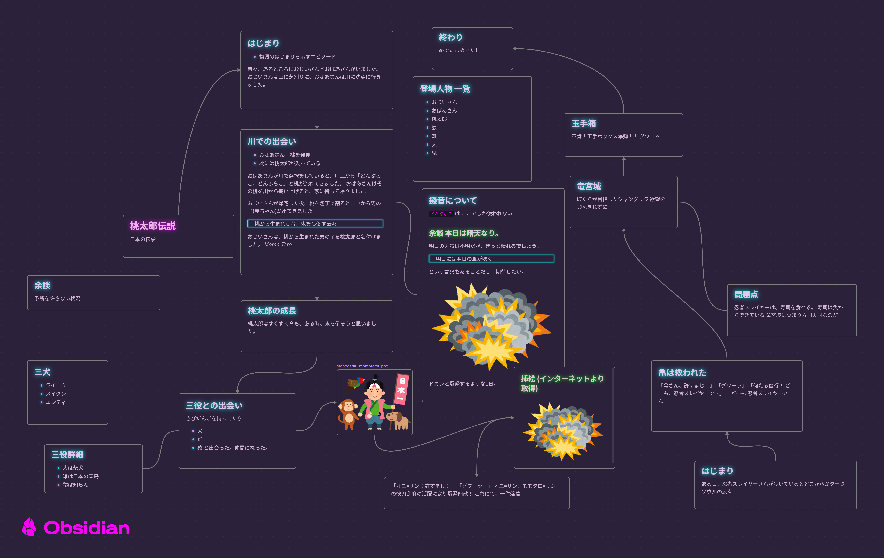
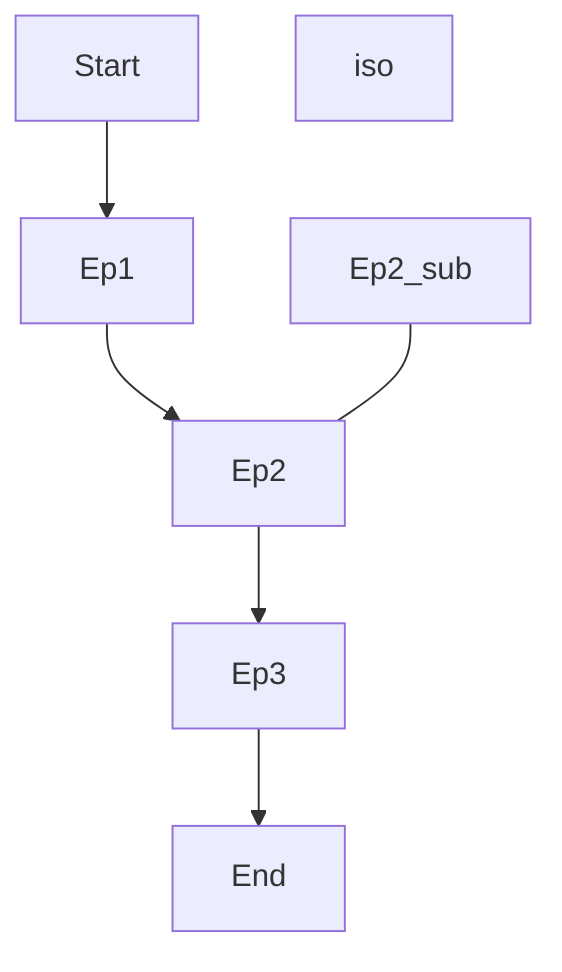
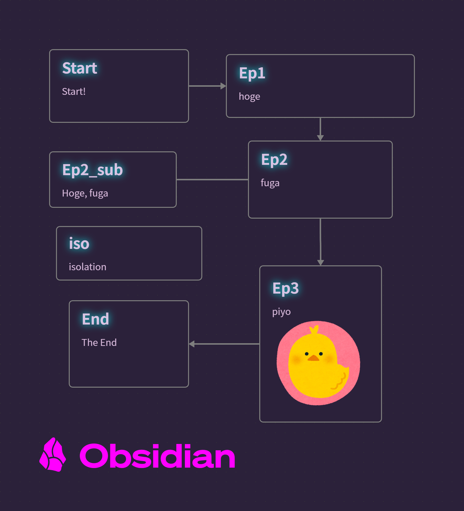
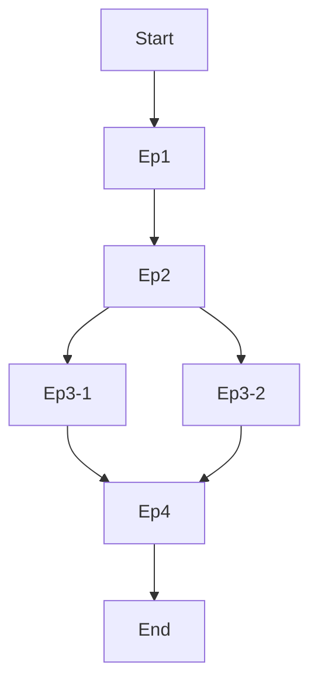
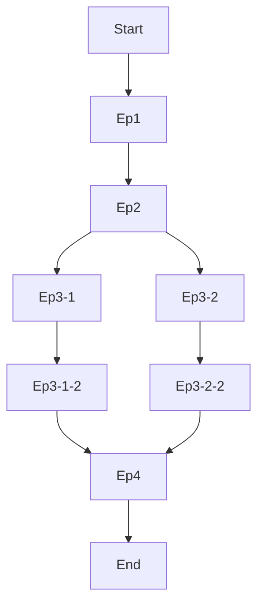
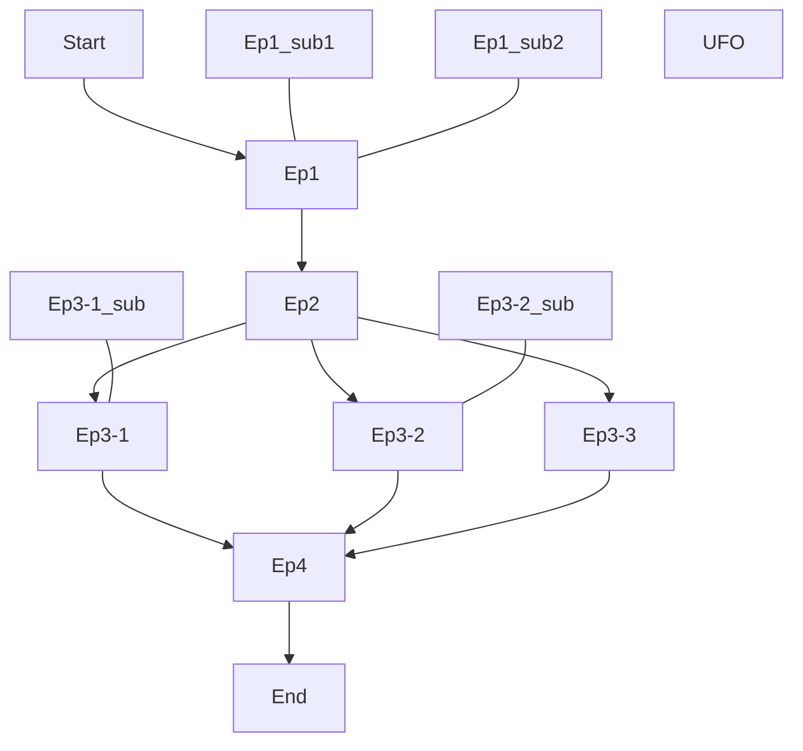
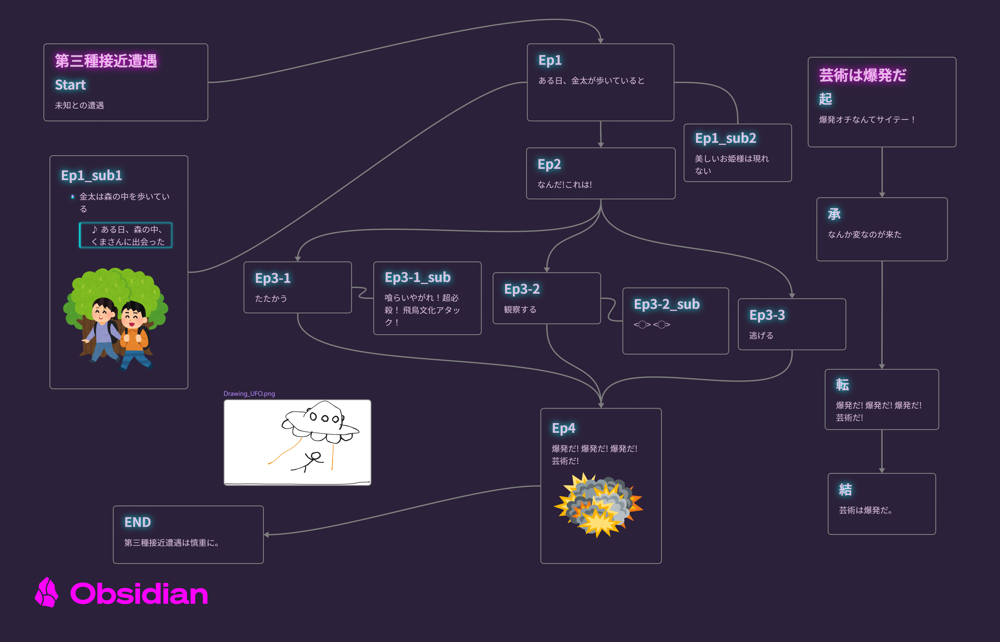

# JSON Canvas to Markdown

## はじめに
==⚠このドキュメントは日本語で書かれています。Google翻訳で日本語から日本語に翻訳しないでください⚠==

JSON Canvasと呼ばれるオープンソースの無限キャンバスツールで作成された`.canvas`データをMarkdownファイルに変換するPythonスクリプトを作成しました。

無限キャンバスツールは小説やゲームのシナリオなどに関するメモを二次元空間に自由に配置し、メモ同士を線や矢印で繋ぐことでプロットを作成するのに便利ですが、そのプロットをファイルとして出力することは容易ではありませんでした。
本スクリプトではノードとエッジの情報をローカルで解析し、矢印で繋がれたメインストーリー, それに関するメモ, そして孤立したメモの3つに分類したあと、それらを1つのMarkdownファイルにまとめて出力します。
これにより、無限キャンバスの内容をテキストファイルに落とし込むという事務作業から開放され、より一層創作活動に専念できるようになります。

## JSON Canvasとは
JSON Canvasは、[Obsidianが2024年3月にリリースした](https://obsidian.md/blog/json-canvas/)、[オープンソース](https://github.com/obsidianmd/jsoncanvas)の無限キャンバス機能です。無限に広がるキャンバス上にノードとエッジを配置し、自由に結びつけることでネットワーク状の情報構造を表現できます。ノードにはテキストやファイル、リンクなどを埋め込むことができ、それらをエッジ(線や矢印)で繋げることで関係性を可視化できます。


## このスクリプトができること
以下のような形式のJSON Canvas(`.canvas`)ファイルをMarkdownファイルにできます。





```Markdown

## Start
Start!


## Ep1
hoge


## Ep2
fuga

[^sub_id]


## Ep3
piyo


## End
The End


[^sub_id]:

    ## Ep2_sub
    Hoge, fuga
    


---

## iso
isolation


---
```


このスクリプトは上記のような構造を、「メインストーリー」, 「サブストーリー」, 「孤立したノード」の3つに分けて解釈します。

- メインストーリー: 矢印で繋がれた一連のノード
    - メインストーリー同士が**一切交わらない場合は**、複数のメインストーリーを持つことができます。
- サブストーリー: ノードに**矢印ではなく線で**紐づいた1つのノード
    - サブストーリーは1つのノードに対して複数紐づけることが可能です
    - ただし、サブストーリーにサブストーリーを紐づけることはできません
- 孤立したノード: どのノードとも紐づいていない1つのノード

また、メインストーリーは限定的ですが、分岐にも対応しています。分岐したノードは「セレクトストーリー」と定義されています。


ただし、セレクトストーリーにサブストーリー以外を紐づけることはできず、すぐに本筋に戻る必要があります。
以下のような構造にはできません。


セレクトストーリーにサブストーリーを紐づけることは可能です。



上記をまとめると以下のようなJSON Canvasに対応できます。



このJSON Canvasは以下のように変換されます

```Markdown

# 芸術は爆発だ
## 起
爆発オチなんてサイテー！


## 承
なんか変なのが来た


## 転
爆発だ! 爆発だ! 爆発だ! 芸術だ!


## 結
芸術は爆発だ。


# 第三種接近遭遇
## Start
未知との遭遇


## Ep1
ある日、金太が歩いていると

[^sub_5e849976a7af99e5]


## Ep2
なんだ!これは!


[セレクトストーリー_1にとぶ](#361b7bde8d02c4b2)

[セレクトストーリー_2にとぶ](#6b043c17fec47cfc)

[セレクトストーリー_3にとぶ](#cdf256927d61c0da)


<a id="361b7bde8d02c4b2"></a>

## Ep3-1
たたかう

[^sub_3fde2aef8dbfec0c]


<a id="6b043c17fec47cfc"></a>

## Ep3-2
観察する

[^sub_83b5c1ab9e72d6ff]


<a id="cdf256927d61c0da"></a>

## Ep3-3
逃げる


## Ep4
爆発だ! 爆発だ! 爆発だ! 芸術だ!


## END
第三種接近遭遇は慎重に。


[^sub_5e849976a7af99e5]:

    ## Ep1_sub1
    - 金太は森の中を歩いている
    > ♪ ある日、森の中、くまさんに出会った
    
    
    


[^sub_383bf8b4978836b7]:

    ## Ep1_sub2
    美しいお姫様は現れない


[^sub_3fde2aef8dbfec0c]:

    ## Ep3-1_sub
    喰らいやがれ！超必殺！
    飛鳥文化アタック！


[^sub_361b7bde8d02c4b2]:

    ## Ep3-1
    たたかう


[^sub_83b5c1ab9e72d6ff]:

    ## Ep3-2_sub
    <◯> <◯>


---


---
```

## その他
詳しくは、[下記の記事](https://www.pottal-portal.com/PtPr3/posts/Canvas2MD.html)をご覧ください。
<https://www.pottal-portal.com/PtPr3/posts/Canvas2MD.html>
