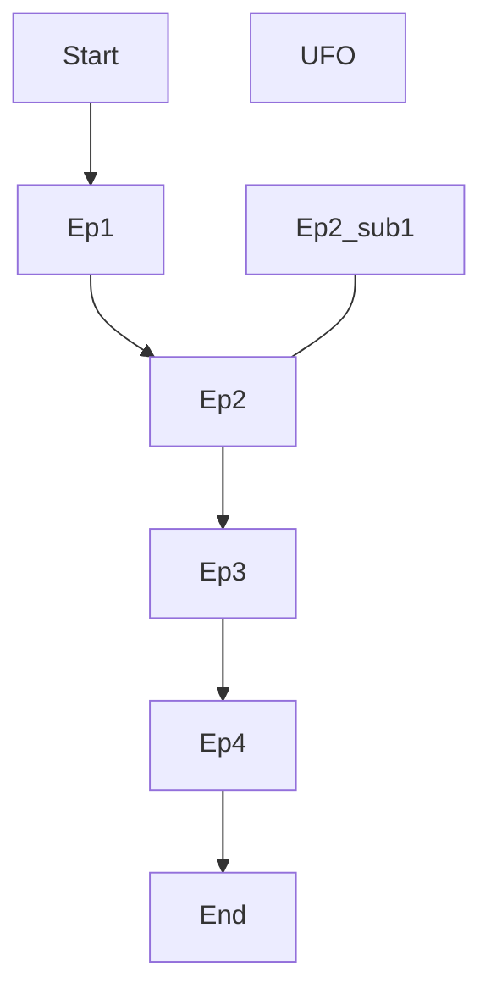

# JSON Canvas to Markdown

## はじめに
==⚠このドキュメントは日本語で書かれています。Google翻訳で日本語から日本語に翻訳しないようにしてください⚠==

JSON Canvasと呼ばれるオープンソースの無限キャンバスツールで作成された`.canvas`データをMarkdownファイルに変換するPythonスクリプトを作成しました。

無限キャンバスツールは小説やゲームのシナリオなどに関するメモを二次元空間に自由に配置し、メモ同士を線や矢印で繋ぐことでプロットを作成するのに便利ですが、そのプロットをファイルとして出力することは容易ではありませんでした。
本スクリプトではノードとエッジの情報をローカルで解析し、矢印で繋がれたメインストーリー, それに関するメモ, そして孤立したメモの3つに分類したあと、それらを1つのMarkdownファイルにまとめて出力します。
これにより、無限キャンバスの内容をテキストファイルに落とし込むという事務作業から開放され、より一層創作活動に専念できるようになります。

## JSON Canvasとは
JSON Canvasは、[Obsidianが2024年3月にリリースした](https://obsidian.md/blog/json-canvas/)、[オープンソース](https://github.com/obsidianmd/jsoncanvas)の無限キャンバス機能です。無限に広がるキャンバス上にノードとエッジを配置し、自由に結びつけることでネットワーク状の情報構造を表現できます。ノードにはテキストやファイル、リンクなどを埋め込むことができ、それらをエッジ(線や矢印)で繋げることで関係性を可視化できます。


## このスクリプトができること
以下のような形式のJSON Canvas(`.canvas`)ファイルをMarkdownファイルにできます。


このスクリプトは上記のような構造を、「メインストーリー」, 「サブストーリー」, 「孤立したノード」の3つに分けて解釈します。

- メインストーリー: 矢印で繋がれた一連のノード
    - メインストーリー同士が**一切交わらない場合は**、複数のメインストーリーを持つことができます。
- サブストーリー: ノードに**矢印ではなく線で**紐づいた1つのノード
    - サブストーリーは1つのノードに対して複数紐づけることが可能です
    - ただし、サブストーリーにサブストーリーを紐づけることはできません
- 孤立したノード: どのノードとも紐づいていない1つのノード

また、メインストーリーは限定的ですが、分岐にも対応しています。分岐したノードは「セレクトストーリー」と定義されています。


ただし、セレクトストーリーにサブストーリー以外を紐づけることはできず、すぐに本筋に戻る必要があります。
以下のような構造にはできません。


セレクトストーリーにサブストーリーを紐づけることは可能です。


上記をまとめると以下のようなJSON Canvasに対応できます。


```Markdown
## Start
`Start`ノードの内容

## Ep1
`Ep1`ノードの内容

## Ep2
`Ep2`ノードの内容[^SubEp]

## Ep3
`Ep3`ノードの内容

## End
`End`ノードの内容

[^SubEp]: `SubEp` の内容

---

## memo
`memo`の内容
```

## その他
詳しくは、[下記の記事](https://www.pottal-portal.com/PtPr3/posts/Canvas2MD.html)をご覧ください。
<https://www.pottal-portal.com/PtPr3/posts/Canvas2MD.html>
